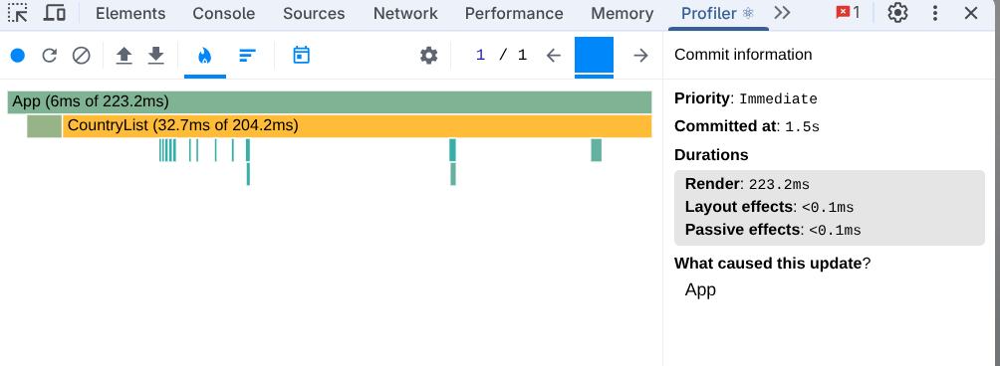
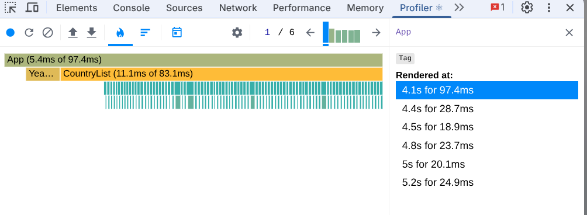
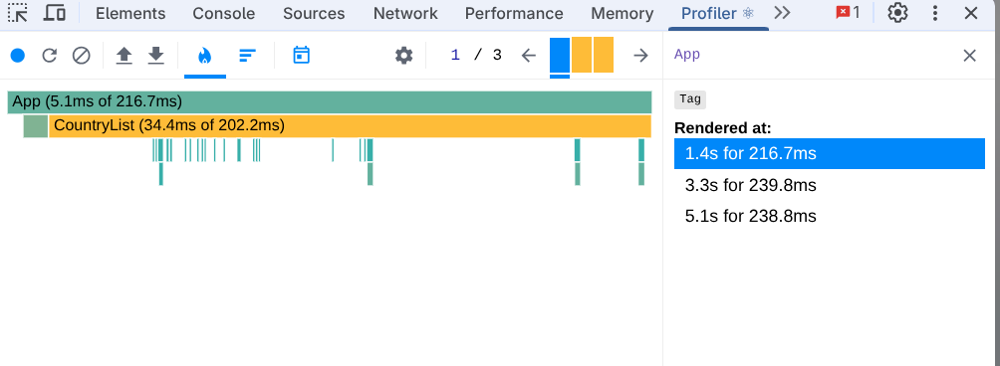
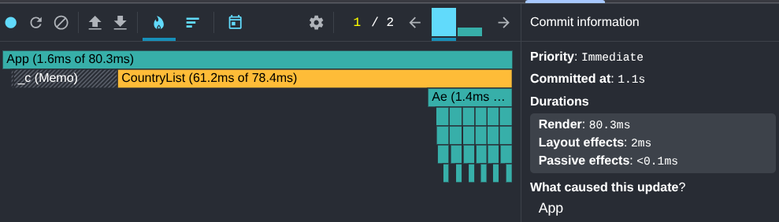
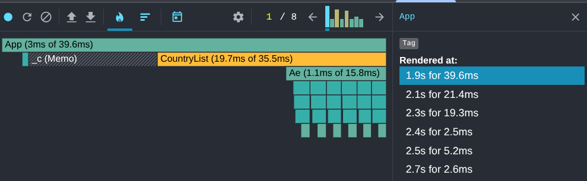
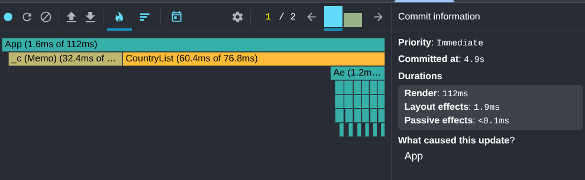
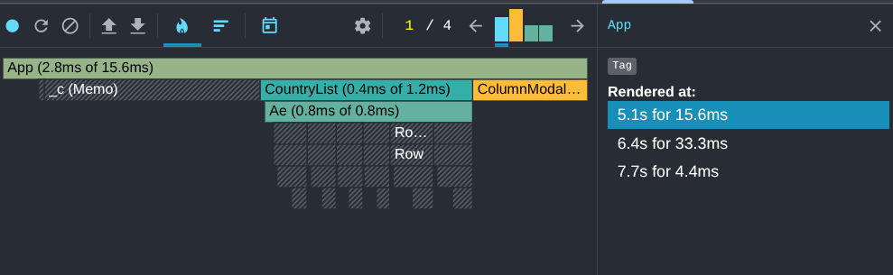

# Performance Optimization Report

## Baseline Measurements

### Interaction A: Sort countries

- **Commit duration**: 223 ms
- **Render duration**: 223 ms
- **Screenshot**: 

### Interaction B: Search countries

- **Commit duration**: 213 ms
- **Render duration**: 213 ms
- **Screenshot**: 

### Interaction C: Change year

- **Commit duration**: 242 ms
- **Render duration**: 242 ms
- **Screenshot**: 

### Interaction D: Toggle column

- **Commit duration**: 695 ms
- **Render duration**: 695 ms
- **Screenshot**: 

## Optimized Measurements

### Interaction A: Sort countries

- **Commit duration**: 82 ms
- **Render duration**: 80 ms
- **Screenshot**: 

### Interaction B: Search countries

- **Commit duration**: 94 ms
- **Render duration**: 91  ms
- **Screenshot**: 

### Interaction C: Change year

- **Commit duration**: 114 ms
- **Render duration**: 112 ms
- **Screenshot**: 

### Interaction D: Toggle column

- **Commit duration**: 53 ms
- **Render duration**: 53 ms
- **Screenshot**: 

## Summary of Improvements

| Interaction      | Baseline (ms) | Optimized (ms) | Improvement |
| ---------------- | ------------- | -------------- | ----------- |
| Sort countries   | 223        | 82          | -63%     |
| Search countries | 213        | 94          | -55%     |
| Change year      | 242        | 114         | -52%     |
| Toggle column    | 695        | 53          | -92%     |
| **Average**      | **343**    | **86**     | **-75%** |