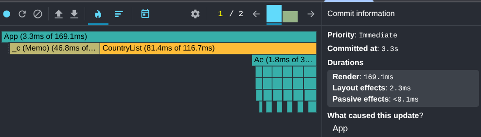
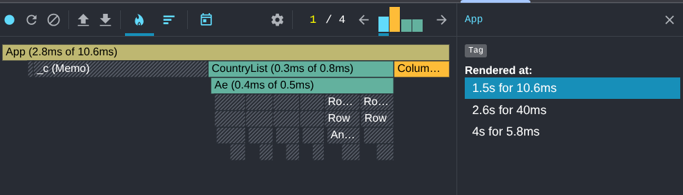

# Performance Optimization Report

## Baseline Measurements

### Interaction A: Sort countries

- **Commit duration**: 223 ms
- **Render duration**: 223 ms
- **Screenshot**: 

### Interaction B: Search countries

- **Commit duration**: 213 ms
- **Render duration**: 213 ms
- **Screenshot**: 

### Interaction C: Change year

- **Commit duration**: 242 ms
- **Render duration**: 242 ms
- **Screenshot**: 

### Interaction D: Toggle column

- **Commit duration**: 695 ms
- **Render duration**: 695 ms
- **Screenshot**: 

## Optimized Measurements

### Interaction A: Sort countries

- **Commit duration**: 102 ms
- **Render duration**: 101 ms
- **Screenshot**: 

### Interaction B: Search countries

- **Commit duration**: 123 ms
- **Render duration**: 117 ms
- **Screenshot**: 

### Interaction C: Change year

- **Commit duration**: 171.4 ms
- **Render duration**: 169.1 ms
- **Screenshot**: 

### Interaction D: Toggle column

- **Commit duration**: 58.4 ms
- **Render duration**: 56.4 ms
- **Screenshot**: 

## Summary of Improvements

| Interaction      | Baseline (ms) | Optimized (ms) | Improvement |
| ---------------- | ------------- | -------------- | ----------- |
| Sort countries   | 223        | 102         | -54%     |
| Search countries | 213        | 123         | -42%     |
| Change year      | 242        | 171         | -29%     |
| Toggle column    | 695        | 58          | -91%     |
| **Average**      | **343**    | **113**     | **-67%** |